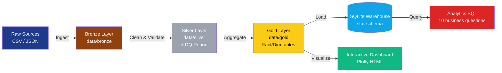

# 📡 Telecom Customer Analytics Platform

> End-to-end data engineering project: ETL pipeline, layered data warehouse, SQL analytics, and interactive dashboard — built on real telecom customer data with 50,000 synthetic CDR records.

**🔗 [Live Dashboard](https://cherukunithish21.github.io/telecom-data-analytics-platform/dashboards/telecom_dashboard.html)** &nbsp;·&nbsp; **📊 [Dashboard Source](./src/build_dashboard.py)** &nbsp;·&nbsp; **🗄️ [Warehouse Schema](./sql/schema.sql)**

---

## 📈 Headline Metrics

| Metric | Value |
|---|---|
| Customers processed | **7,043** |
| CDR events generated & ingested | **50,000** |
| Cell towers modeled | **200** across 5 regions |
| Monthly recurring revenue | **$456,117** |
| Churn rate | **26.5%** |
| Monthly revenue at risk | **$139,131** |
| End-to-end pipeline runtime | **~13 seconds** |

---

## 🏗️ Architecture

**Medallion architecture** (Bronze → Silver → Gold) mirrors what runs in production on Azure Synapse / Snowflake / Databricks. SQLite is used here for portability — same SQL, zero install.

---

## 🛠️ Tech Stack

| Layer | Technology |
|---|---|
| Language | **Python 3.12**, **SQL** |
| Data processing | **Pandas**, **NumPy**, **PyArrow** (Parquet) |
| Warehouse | **SQLite** (SQL syntax compatible with Synapse / Snowflake) |
| Orchestration | Modular pipeline runner (Airflow-ready) |
| Visualization | **Plotly** (interactive HTML dashboard) |
| Data quality | Custom DQ framework with referential-integrity assertions |
| Storage formats | CSV (raw), Parquet (cleaned), SQLite (warehouse) |
| Version control | Git, GitHub |

In production this would map to: **Azure Data Factory** (orchestration), **ADLS** (data lake), **Azure Synapse** (warehouse), **Power BI** (dashboards).

---

## 📂 Project Structure